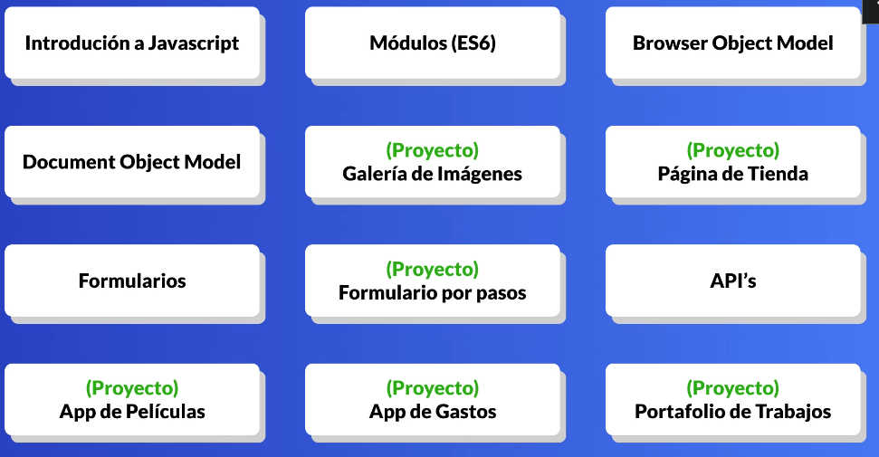

# SECCION 1

## 1. Introduccion al curso



## 2. ¿Que necesitas para seguir el curso?

## 3. Descarga de recursos del curso

https://github.com/falconmasters/curso_javascript-

## 4. Que es Javascript

## 5. Iniciando la estructura del curso

```html
<!DOCTYPE html>
<html lang="en">

<head>
    <meta charset="UTF-8">
    <meta http-equiv="X-UA-Compatible" content="IE=edge">
    <meta name="viewport" content="width=device-width, initial-scale=1.0">
    <link rel="stylesheet" href="estilos.css">
    <title>Mi primera pagina web con Javascript</title>
</head>

<body>
    <h1>Hola Mundo!</h1>
</body>

</html>
```

```css
@import url('https://fonts.googleapis.com/css2?family=Poppins:wght@400;600&display=swap');

* {
	box-sizing: border-box;
	margin: 0;
	padding: 0;
}

body {
	font-family: 'Poppins', sans-serif;
	min-height: 100vh;
	width: 100%;
	background: #eaeaea;
	color: #000;
	display: flex;
	flex-direction: column;
	align-items: center;
	justify-content: center;
}

h1 {
	font-size: 80px;
}

h2 {
	font-size: 40px;
	font-weight: normal;
	margin-bottom: 40px;
	color: #848484;
}

button {
	border: none;
	background: #2553df;
	font-family: 'Poppins', sans-serif;
	font-size: 22px;
	cursor: pointer;
	border-radius: 10px;
	color: #fff;
	padding: 14px 28px;
	margin-bottom: 20px;
}

button:hover {
	background: #1942be;
}
```

## 6. Hola Mundo

```html
<!DOCTYPE html>
<html lang="en">

<head>
    <meta charset="UTF-8">
    <meta http-equiv="X-UA-Compatible" content="IE=edge">
    <meta name="viewport" content="width=device-width, initial-scale=1.0">
    <link rel="stylesheet" href="estilos.css">
    <title>Mi primera pagina web con Javascript</title>
    <!-- Forma #2 - Etiqueta Script en head-->
    <script defer>  //  Con defer esperamos que primero se cargue todo el contenido html
        alert('Se ejecuta desde el head');
    </script>

    <!-- Forma #3 - Archivo externo-->
    <script defer src="./holaMundo.js"></script>
</head>

<body>
    <h1>Hola Mundo!</h1>

    <!-- Forma #1 - Etiqueta Script -->
    <script>
        // Notas importantes:
        // - Javascript es sensible a mayusculas y minusculas.
        // - Respetar la sintaxis de tipo camel case. getElementById
        // - Punto y como al final de cada sentencia.

        //Comentarios de tipo linea
        /*
            Comentatios de vatias lineas
            (tipo bloque)
        */
       //El codigo comentado no se ejecuta
       //alert('Este codigo no se ejecuta');
        document.write("Hola Mundo");
        document.write("<h2>Como estas</h2>");
        alert("Soy una alerta");
        console.log('Hola, desde la consola');
    </script>
</body>

</html>
```

```js
alert('Hola mundo desde archivo externo');
```

## 7. Preparando los archivos de la seccion

```html
<!DOCTYPE html>
<html lang="en">
<head>
    <meta charset="UTF-8">
    <meta http-equiv="X-UA-Compatible" content="IE=edge">
    <meta name="viewport" content="width=device-width, initial-scale=1.0">
    <link rel="stylesheet" href="./estilos.css">
    <script defer src="./variables.js"></script>
    <title>Curso de Javascript</title>
</head>
<body>
    <h1>Curso de Javascript</h1>
    <h2>Competo, Practico y desde cero</h2>
</body>
</html>
```

## 8. Variables

```js
/*
	📌 Qué son las variables:
	- Espacios en memoria donde podemos guardar informacion, normalmente son valores pequeños que nuestro sitio web o aplicacion utilizarán.
*/

/* 📌 Reglas de las variables:
	- Todas las variables deben tener nombres únicos.
	- Deben empezar por al menos una letra.
	- También pueden empezar por el simbolo $ y _ pero es muy poco común.
	- No se pueden usar palabras reservadas como nombre. (ejemplo: for)
*/

/* 📌 Tipos de datos que podemos guardar en las variables:
    string - Cadena de Texto
    number - Numero
    boolean - Booleano (verdadero o falso)
    object - Objeto
    function - Funciones

	null - Valor nulo
	undefined - Valor sin definir
*/

var edad;
//console.log(edad);

let nombre = 'Carlos';
nombre = 'Juan';
//console.log(nombre);

const correo = 'correo@correo.com';
//correo = 'correo2@gmail.com'

let telefono, pais, id;
telefono = 123456789;
//console.log(telefono);

const resultado = 4 + 4;
//console.log(resultado);

const nombre1 = 'Carlos ';
const nombre2 = 'Arturo';
const nombreCompleto = nombre1 + nombre2;
console.log(nombreCompleto);

let miVariable = 'texto';
miVariable = 7;
```

## 9. Tipos de datos (cadenas de texto y numeros)

```js
/* 📌 Tipos de datos que podemos guardar en las variables:
	string - Cadena de Texto
	number - Numero
	boolean - Booleano (verdadero o falso)
	object - Objeto
	function - Funciones

	null - Valor nulo
	undefined - Valor sin definir
*/

//Cadena de texto
const nombre = 'Carlos';
const parrafo = "Este es un 'parrafo'";
const parrafo2 = 'Este es un "parrafo"';
//const parrafo3 = 'Este es un \'parrafo\'';

// Numero
const numero = 4;
const numero2 = -4.123;

// Booleano
const usuarioConectado = false;
const mayorQue = 10 > 2;
console.log(mayorQue);
```

## 10. Tipos de datos (arreglos, objetos y funciones)

```js
// Arrays - Arreglos
const arreglos = ['texto', 456, true, {propiedad : 'valor'}, [1, 2, 3]];

//Objeto
const persona = {
    nombre : 'Carlos',
    edad : 27,
    carro : {
        marca : 'toyota',
        color : 'negro',
    },
};
//console.log(persona.carro.color);

//Function
function hola() {
    console.log('Hola');
}
hola();

// Null
// Normalmente lo usamos cuando queremos especificar que un valor sea nulo.

//Undefined
//Undefined se usa para indicarnos que un valor no esta definido
```

## 11. Operadores aritmeticos y de comparacion

```js
// Los operadores nos permiten asignar elementos, hacer cálculos básicos y comparaciones.

/* 📌 Operadores Aritmeticos
	=	Operador de asignación. Se usa para asignar valores a una variable
	+	Suma
	-	Resta
	*	Multiplicación
	/	Division
	%	Modulo
	++	Aumento
	--	Disminución
*/

const resultado = 10 % 3;
//console.log(resultado);

let numero = 1;
numero = numero + 1;    //numero++;
//console.log(numero);

/*📌 Operadores de Asignación
	+=	Suma un numero al valor de una variable.
	-=	Resta un numero al valor de una variable.
	*=	Multiplicar un numero al valor de una variable.
	/=	Dividir un numero al valor de una variable.
	%=	Obtiene el sobrante de una division y lo asigna a la variable.
*/

let numero2 = 10;
numero2 += 5;
//console.log(numero2)

/* 📌 Operadores de Comparación:
Nos permiten comparar valores
	==		Igual que
	===		Igual en valor y typo de valor
	!=		Diferente
	!==		Diferente en valor y diferente en typo
	>		Mayor que
	<		Menor que
	>=		Mayor o igual que
	<=		Menor o igual que
	?		Operador ternario
*/

const resultado3 = 5 > 1;
console.log(resultado3);

const resultado4 = 10 > 10;
console.log(resultado4);

const resultado5 = 10 == 10;
console.log(resultado5);

const resultado6 = 10 == '10';  //true
console.log(resultado6);

const resultado7 = 10 === '10';  //false
console.log(resultado7);

const resultado8 = 7 > 1 ? 'El primer valor es mayor que el segundo' : 'El segundo valor es mayor que el primero';  //false
console.log(resultado8);
```

## 12. Operadores logicos

```js
/* 📌 Operadores Lógicos 
	&& 	And
	||	OR
	! 	NOT
*/

const nombre = 'Carlos';
const edad = 17;
const tieneEntrada = true;
const tienePermiso = false;

// Ejemplo #1
// const permitirAcceso = edad > 18 && tieneEntrada; // true
// console.log('Acceso permitido al concierto: ' + permitirAcceso);

// Ejemplo #2 - OR
// const permitirAcceso = (edad > 18 && tieneEntrada) || (tieneEntrada && tienePermiso);
// console.log('Acceso permitido al concierto: ' + permitirAcceso);

// Ejemplo #3 - !
// Retorna true si un valor es negativo
const variable = true;
console.log(!variable); // false
```

## 13. Arreglos

```js
/* 📌 Los arreglos son variables que nos permiten guardar multiples valores
	Cada valor puede ser de cualquier tipo.
*/
const arreglo = ['Texto', 456, true, { propiedad: 'valor' }, [0, 1, 2, 3]];
console.log(arreglo);

// Podemos acceder a los elementos del arreglo en base a su posicion.
// Empezando por el 0 (index)
const amigos = ['Alejandro', 'Manuel', 'Cesar'];
console.log(amigos[0]);

/* 📌 Otra forma de trabajar con arreglos es definirlo y luego llenarlo */
const colores = [];
colores[0] = 'Rojo';
colores[1] = 'Verde';

// Podemos saltarnos elementos
colores[3] = 'Blanco';

// Podemos sobreescribir valores
colores[3] = 'Amarillo';

/* Los arreglos dentro de javascript son objetos.
Esto es porque javascript les agrega una capa de propiedades y metodos.
*/
// Propiedad length, nos permite conocer cuantos elementos tiene un arreglo.
console.log('El arreglo colores tiene: ' + colores.length + ' colores');

// Metodo push, nos permite agregar elementos al final del arreglo.
colores.push('Azul');
console.log(colores);
```

## 14. Objetos

```js
/* 📌 Los objetos en Javascript son variables en las que podemos estructurar informacion mediante parejas de claves y valores.

    Igual que los arreglos podemos guardar multiples valores.
    La diferencia es que en los objetos tenemos propiedades con las que podemos identificar y llamar los valores.
*/

// Ejemplo de arreglo poco útil.
// Nombre, edad, correo, suscripcion al sitio, suscripcion a los correos promocionales.
// const persona = ['Carlos', 27, 'correo@correo.com', true, true];
// console.log(persona[0]);

// Ejemplo con un objeto.
const persona = {
    nombre: 'Carlos',
    edad: 27,
    correo: 'correo@correo.com',
    suscripciones: {
        suscripcionWeb: true,
        suscripcionCorreo: true,
    },
    coloresFavoritos: ['Negro', 'Rojo'],
    saludo: function () {
        alert('Hola!');
    },
};
console.log(persona.nombre);
console.log(persona['edad']);

// Esto es muy util para trabajar con variables
const variable = 'correo';
console.log(persona[variable]);

// Podemos agregar nuevos valores a un objeto
persona.pais = 'Mexico';
console.log(persona);

// Podemos sobreescribir valores
persona.pais = 'España';
console.log(persona);

// Los objetos tambien pueden tener metodos.
persona.saludo();
```

## 15. Template literals / Template strings

```js
/* 📌 Los template strings son una nueva forma que tenemos en Javascript (ES6) para trabajar con cadenas de texto y que estas puedan incluir expresiones de javascript. Como variables por ejemplo.
 
También se les conoce como template literals. */
const nombre = 'Carlos';

// Formas de trabajar con variables y cadenas de texto.
// console.log('Hola ' + nombre + ' buenos dias.');

// Con template strings.
console.log(`Hola ${nombre} buenos dias`);

// Podemos trabajar con variables y operadores.
const amigos = ['Alejandro', 'Cesar', 'Manuel'];
console.log(`${nombre} tiene ${amigos.length} amigos`);

// Tambien son muy utiles para trabajar con HTML.
const plantilla = `
	<h1>${nombre} tiene ${amigos.length} amigos</h1>
`;

// Accedemos al objeto del documento.
// Luego a la propiedad body.
// Luego a la propiead innerHTML y le establecemos la plantilla.
document.body.innerHTML = plantilla;
```

## 16. Condicionales

```js
/* 📌 Las condicionales son un tipo de bloque que nos permite ejecutar código dependiendo de si se cumple una condición o no 
	Normalmente se utilizan operadores de comparación.
*/

/*
	📌 Operadores de Comparación:
	==		Igual que
	===		Igual en valor y typo de valor
	!=		Diferente
	!==		Diferente en valor y diferente en typo
	>		Mayor que
	<		Menor que
	>=		Mayor o igual que
	<=		Menor o igual que
	?		Operador ternario

	📌 Operadores Lógicos 
	&& 	And
	||	OR
	! 	NOT
*/

// 📌 Estructura de una condicional
/* Condición */
if (true) {
	// Código a ejecutar
}

// 📌 Ejemplo #1:
// const usuario = {
// 	edad: 27,
// 	pais: 'mexico',
// 	ticket: true,
// };

// if (usuario.edad > 17) {
// 	// edad >= 18
// 	console.log('El usuario es mayor de edad, puede entrar al concierto.');
// } else {
// 	console.log('El usuario es menor de edad, no puede entrar al concierto');
// }

// 📌 Ejemplo #2 - combinando operadores
// const usuario = {
// 	edad: 27,
// 	pais: 'mexico',
// 	ticket: false,
// };
// if (usuario.edad > 17 && usuario.ticket) {
// 	// edad >= 18
// 	console.log('El usuario es mayor de edad y tiene un ticket.');
// } else {
// 	console.log('El usuario es menor de edad o no tiene un ticket.');
// }

// 📌 Ejemplo #3 - Anindando condicionales
// const usuario = {
// 	edad: 27,
// 	pais: 'mexico',
// 	ticket: false,
// };

// if (usuario.edad >= 18) {
// 	if (usuario.ticket) {
// 		console.log('El usuario es mayor de edad y tiene ticket.');
// 	} else {
// 		console.log('El usuario es mayor de edad, pero no tiene ticket.');
// 	}
// } else {
// 	console.log('El usuario es menor de edad, no puede entrar al concierto.');
// }

// 📌 Ejemplo #4 - elseif
const usuario = {
	edad: 27,
	pais: 'colombia',
	ticket: false,
};

if (usuario.pais === 'mexico') {
	console.log('El usuario es mexicano');
} else if (usuario.pais === 'españa') {
	console.log('El usuario es español');
} else if (usuario.pais === 'argentina') {
	console.log('El usuario es argentino');
} else {
	console.log('El usuario es de otro pais');
}
```

## 17. Condicional switch

```js
/* 📌 
	Switch es un bloque de codigo similar a elseif
	que nos permite ejecutar código en base a una condición, en este caso cuando un valor sea igual a otro.
*/

const usuario = {
	edad: 27,
	pais: 'mexico',
};

// Nota: no olvidarnos de la palabra break.

switch (usuario.pais) {
	case 'mexico':
		console.log('El usuario es mexicano');
		break;
	case 'españa' && edad >= 18:
		console.log('El usuario es español');
		break;
	case 'argentina':
		console.log('El usuario es argentino');
		break;
	default:
		console.log('El usuario es de otro pais');
}

// Condicional elseif
// if (usuario.pais === 'mexico') {
// 	console.log('El usuario es mexicano');
// } else if (usuario.pais === 'españa') {
// 	console.log('El usuario es español');
// } else if (usuario.pais === 'argentina') {
// 	console.log('El usuario es argentino');
// } else {
// 	console.log('El usuario es de otro pais');
// }

/*
	Cuando usar else if y cuando switch.
	elseif nos permite tener condiciones mas complejas:
		} else if (usuario.pais === 'españa' && usuario.edad >= 18) {

	switch nos permite ejecutar codigo si una variable contiene X valor:
		case 'españa':
*/
```

## 18. Operador ternario

```js
/*
	El operador ternario nos permite hacer condicionales abarcando menos codigo que si utilizaramos un condicional if.
*/

// Ejemplo de condicional sin operador ternario.
// const boleto = 'vip';
// let codigoDeAcceso;

// if (boleto === vip) {
// 	codigoDeAcceso = 'VIP-123-456-789';
// } else {
// 	codigoDeAcceso = 'Regular-123-456-789';
// }

// Ejemplo con operador ternario
const boleto = 'vip';
const codigoDeAcceso = boleto === 'VIP' ? 'VIP-123-456-789' : 'Regular-123-456-789';

// Ejemplo 2 - No siempre es necesario guardar el valor en una variable
boleto === 'VIP' ? console.log('Tu boleto es VIP-123-456-789') : console.log('Tu boleto es Regular-123-456-789');
```

## 19. Funciones

```js
/*
	Las funciones son bloques de código que nos permiten repetir acciones sin tener que duplicar código.
	Un ejemplo muy común de donde se utilizan es cuando presionamos un boton, invocamos una funcion y ejecuta el codigo.
*/

// 📌 Forma #1
// function saludo() {
// console.log('Hola!');
// }

/* 📌 Invocamos la funcion
	Podemos invocar las funciones dentro de nuestro código, o con diferentes eventos.
	Por ejemplo cuando el usuario de click en un boton.
	
	Nota: Los parentesis son lo que invoca la función. Si no usamos parentesis solo tenemos una referencia de la función.
*/
// saludo(); // Invocamos la funcion
// const variable = saludo; // Guardamos la funcion en una variable

// 📌 Forma #2 - Asignando una funcion a una variable.
// const saludo = function () {
// 	console.log('Hola!');
// };
// saludo();

// 📌 Forma #3 - Función de tipo flecha
// const saludo = () => {
// 	console.log('Hola!');
// };
// saludo();
```

## 20. Parametros y argumentos de funcion

```js
/*
	📌 En las funciones podemos definir parametros, que son valores que la funcion puede utilizar.
*/
/*
 - Parametros: los valores especificados en la definición
 - Argumentos: los valores que le pasamos a la función cuando la invocamos.
*/

// const saludo = (nombre = 'amigo') => {
// 	console.log(`Hola, ${nombre}!`);
// };

// saludo('Carlos');
// saludo();

/*
	📌 Multiples parametros
*/
// const operacion = (tipo, numero1, numero2) => {
// 	console.log(tipo);

// 	if (tipo === 'suma') {
// 		console.log(numero1 + numero2);
// 	} else if (tipo === 'resta') {
// 		console.log(numero1 - numero2);
// 	}
// };

// operacion('resta', 2, 5);

// Las funciones de tipo flecha las podemos resumir en una linea de codigo
const operacion2 = (tipo, numero1, numero2) => (tipo === 'suma' ? numero1 + numero2 : numero1 - numero2);
console.log(operacion2('', 1, 1));
```

## 21. Sentencia return

```js
/*
	Una buena practica es que las funciones se encarguen de realizar una sola tarea.
	La funcion anterior hace la operacion y luego la publica. Podemos optimizar el codigo con un return.
*/
/*
	📌 Sentencia Return
	La sentencia return nos permite que la funcion devuelva/retorne un valor.
	El return para la ejecucion del código dentro de la funcion.
*/
const operacion = (tipo, numero1, numero2) => {
	let resultado;

	if (tipo === 'suma') {
		resultado = numero1 + numero2;
		// return resultado;
	} else if (tipo === 'resta') {
		resultado = numero1 - numero2;
		// return resultado;
	}

	return resultado;
	console.log('Este codigo no se ejecuta');
};

console.log(operacion('resta', 10, 1));
console.log(operacion('suma', 100, 11));

const variable = operacion('suma', 5, 5);
console.log(variable);
```

## 22. Variables globales (scope de javascript)

## 23. Variables locales (scope de javascript)

## 24. Variables de bloque (scope de javascript)

```js
/*
	El scope de javascript (ambito de las variables) determina si podemos
	 acceder a una variable o no en ciertas partes de nuestro código.
*/
/*
	- Global Scope o Variables Globales - Podemos acceder a las variables desde cualquier parte del código.
	- Function Scope - Las variables creadas dentro de una funcion solo pueden ser accedidas dentro de la función.
	- Block Scope (desde ES6) - Las variables creadas dentro de un bloque { } no pueden ser accedidas fuera del bloque.
		- Utilizamos const y let
*/

/* 📌 Global Scope o Variables Globales
	- Son las variables declaradas fuera de una funcion.
	- Podemos acceder a ellas desde cualquier parte del código.
	- Podemos usar const, let y var.
*/
var nombre = 'Carlos'; // Variable global

// Podemos acceder a la variable fuera de una función
console.log(nombre); // Carlos

const saludo = () => {
	// Podemos acceder a la variable dentro de una función
	console.log('Hola ' + nombre); // Hola Carlos

	// Podemos cambiar su valor.
	nombre = 'Arturo';
	console.log(`El nuevo nombre es: ${nombre} `);
};
saludo();

/* 📌 Local Scope o Variables Locales
	- Son las variables declaradas dentro de una función.
	- Solo podemos acceder a ellas desde dentro de la función.
*/

var obtenerNumeroLetras = (nombre) => {
	var numero = nombre.length;

	// Podemos acceder dentro de la función al numero
	console.log('Carlos tiene ' + numero + ' letras');

	// Podemos acceder a numero dentro desde cualquier parte DENTRO de la función
	// Incluso otra funcion
	var funcionAnidada = () => {
		// Podemos acceder a numero porque sigue estando dentro de la funcion donde fue definida.
		console.log(numero);
	};
	funcionAnidada();
};

obtenerNumeroLetras('carlos');

// Fuera de la funcion no podemos acceder a la variable numero.
console.log(numero); // variable not defined

/* 📌 Block Scope o Alcance de tipo bloque
	- Son las variables declaradas con const o let dentro de un bloque { }
	- Solo podemos acceder a ellas dentro del bloque
*/

let edad = 19;
if (edad >= 18) {
	const accesoPermitido = true;

	console.log(accesoPermitido); // Dentro del bloque si podemos acceder a la variable

	// Incluso dentro de otros bloques.
	if (true) {
		// Podemos acceder a la variable
		console.log(accesoPermitido);
	}

	// Otro tipo de bloques son las funciones
	const miFuncion = () => {
		// Podemos acceder a la variable
		console.log(accesoPermitido);
	};

	miFuncion();
}

console.log(accesoPermitido); // No podemos acceder a la variable. Estamos fuera del bloque.

/*
	Debemos procurar utilizar solamente const y let porque son las que nos proporcionan un scope de tipo bloque.
	Este scope es mejor que el global porque nos permitira evitar bugs ya
	 que las variables solo se podran acceder dentro del bloque y evitaremos que otras funciones las modifiquen.
*/

if (true) {
	var nombre = 'Arturo';
	console.log(nombre); // Podemos acceder a la variable.
}

console.log(nombre); // Tambien podemos acceder a la variable.

// La mayoria del tiempo no queremos esto, ya que las funciones muchas veces necesitaran sus propias varibles.
// Lo mejor es trabajar con const y let para evitar que fuera del bloque se puedan acceder a las variables.

if (true) {
	const nombre = 'Carlos';
	console.log(nombre); // Podemos acceder a la variable.
}
console.log(nombre); // No podemos acceder a la variable.
```

## 25. Metodos para trabajar con arreglos (Parte 1)
## 26. Metodos para trabajar con arreglos (Parte 2)

```js
/*
	Los arreglos en javascript en realidad son objetos. 
	Esto significa que pueden contener propiedades y métodos.
	Vamos a ver algunas de las propiedades y métodos mas importantes:
*/
const colores = ['Rojo', 'Verde', 'Azul'];

/* 
	📌 .length 
	(propiedad) - Nos permite conocer la cantidad de elementos de un arreglo.
*/
// console.log(colores.length);

/*
	📌 .toString() 
	Nos permite transformar un arreglo a una cadena de texto.
	Por ejemplo para poder mostrarlo en el navegador.
*/
document.body.innerHTML = colores.toString();

/*
	📌 .join()
	Nos permite transformar un arreglo a una cadena de texto y separar cada elemento. 
*/
// console.log(colores.join('|'));

/*
	📌 .sort()
	Nos permite ordenar un arreglo de cadenas de texto, de forma alfabetica.
*/
const letras = ['c', 'b', 'd', 'a'];
console.log(letras.sort());

// Tambien puede ordenar numeros.
const numeros = [3, 2, 4, 1];
console.log(numeros.sort());

/*
	📌 .reverse()
	Nos permite ordenar un arreglo de forma descendente. 
*/
console.log(letras.reverse());
console.log(numeros.reverse());

/*
	📌 .concat()
	Nos permite juntar dos arreglos en uno solo. 
*/
const arreglo1 = [1, 2, 3];
const arreglo2 = ['A', 'B', 'C'];
const arreglo3 = arreglo1.concat(arreglo2);

/* 
	📌 .push()
	Nos permite agregar un elemento al final de un arreglo.
*/
colores.push('Amarillo');

/*
	📌 .pop()
	Nos permite eliminar el ultimo elemento de un arrreglo. 
*/
colores.pop();

/* 
	📌 .shift()
	Elimina el primer elemento de un arreglo y recorre los elementos.
*/
const dias = ['Lunes', 'Martes', 'Miercoles', 'Jueves', 'Viernes', 'Sabado', 'Domingo'];
console.log(dias[0]); // Lunes
const diaEliminado = dias.shift(); // Lunes

console.log(dias);
console.log(dias[0]); //Martes

/*
	📌 .unshift()
	Agrega un elemento al inicio del arreglo y empuja los elementos.
*/
dias.unshift('Carlos');
console.log(dias);

/* 
	📌 .splice()
	Nos permite insertar elementos a un arreglo donde le especifiquemos.
	- 1er parametro - Posición donde queremos comenzar a insertar los elementos.
	- 2do parametro - Cuantos elementos eliminar desde la posición indicada.
	- Resto de parametros - Los elementos a insertar.
*/
const amigos = ['Alejandro', 'Cesar', 'Manuel'];
amigos.splice(1, 2, 'Rafael', 'Roberto');

// Tambien podemos usar splice para eliminar elementos sin insertar ninguno.
// amigos.splice(1, 1);

console.log(amigos);

/* 📌 .slice()
	Nos permite copiar una parte de un arreglo a otro.
	- 1er parametro - Posición desde donde queremos copiar.
	- 2do parametro - Hasta antes de que elemento copiar.
*/
const frutas = ['Fresa', 'Manzana', 'Uva', 'Piña', 'Mango', 'Naranja', 'Melon'];
const frutasFavoritas = frutas.slice(1, 5);
console.log(frutasFavoritas);
```

## 27. Metodos para trabajar con arreglos (Parte 3)

## 28. Metodos para trabajar con arreglos (Parte 4)

## 29. Metodos para trabajar con arreglos (Parte 5)

```js
/* 📌 .indexOf()
	Obtenemos el primer index de un elemento.
	Si no hay elemento nos retorna -1
*/
const nombres = ['Carlos', 'Rafael', 'Estefania', 'Rodrigo', 'Rafael', 'Gema', 'Diana', 'Sara'];
console.log(nombres.indexOf('Rafael')); // 1
console.log(nombres.indexOf('Sergio')); // -1

/* 
	📌 .lastIndexOf() 
	Obtenemos el ultimo index de un elemento.
*/
console.log(nombres.lastIndexOf('Rafael')); // 4

/* 	
	📌 .foreach()
	Nos permite ejecutar una funcion por cada elemento
*/
nombres.forEach((nombre, index) => {
	console.log(`Hola ${nombre} (index: ${index})`);
});

/* 
	📌 .find()
	Nos permite recorrer un arreglo y devuelve el PRIMER elemento que retornemos.
*/
// Ejemplo donde obtenemos el primer nombre que empiece por una letra.
const letra = 'E';
const resultado = nombres.find((nombre) => {
	// Por cada elemento del arreglo ejecutamos la funcion
	// Si la primera letra de un dia empieza por A lo devolvemos.

	if (nombre[0] === letra) {
		return nombre;
	}
});
console.log(resultado);

/* 
	📌 .map()
	Nos permite ejecutar una función por cada elemento y crear un nuevo arreglo
	en base a los resultados de esa función.
*/
// Ejemplo: Crear arreglo que contiene los nombres en mayusculas.
const nombresMayusculas = nombres.map((nombre) => {
	return nombre.toUpperCase();
});

// Forma corta:
//const nombresMayusculas = nombres.map((nombre) => nombre.toUpperCase());
console.log(nombresMayusculas);

/* 📌 .filter()
	Nos permite ejecutar una funcion por cada elemento 
	y luego crear un arreglo en base a los resultados de esa función. 
*/
// Ejemplo: Crear un arreglo que contenga los nombres que tengan 4 letras.
const nombres4Letras = nombres.filter((nombre) => {
	if (nombre.length === 4) {
		return nombre;
	}
});
console.log(nombres4Letras);

/* 
	📌 .includes()
	Nos permite saber si el arreglo contiene un elemento especificado 
*/
console.log(nombres.includes('Julio')); // false
console.log(nombres.includes('Carlos')); // true

/* 
	📌 .every()
	Nos permite ejecutar un condicional sobre cada elemento y 
	nos devuelve true si TODOS los elemento cumplieron la condición.
*/
// Ejemplo: Comprobamos que todos los nombres sean cadenas de texto.
const nombresValidos = nombres.every((nombre) => {
	if (typeof nombre === 'string') {
		return true;
	} else {
		return false;
	}
});
console.log('¿Todos los nombres son validos? ' + nombresValidos); // True

/* 
	📌 .some()
	Nos permite ejecutar un condicional sobre cada elemento y
	nos devuelve true si algun elemento cumplio la condición. 
*/
const arregloInvalido = nombres.some((nombre) => {
	if (typeof nombre !== 'string') {
		return true;
	} else {
		return false;
	}
});
console.log('¿El arreglo es invalido? ' + arregloInvalido);
// true si hay algun valor invalido
// false si no hay algun valor invalido
```

## 30. Metodos para trabajar con objetos

```js
const usuario = {
	nombre: 'Carlos',
	edad: 27,
	amigos: ['Alejandro', 'Cesar', 'Manuel'],
	saludo: () => {
		console.log('Hola!');
	},
};

/*
	📌 Métodos propios
	Los objetos pueden tener métodos personalizados.
*/
usuario.saludo();

/*
	📌 Object.keys()
	Nos devuelve un arreglo con las llaves (keys) del objeto.
*/
const resultado = Object.keys(usuario);

/*
	📌 Object.values()
	Nos devuelve un arreglo con los valores (values) del objeto.
*/
// const resultado = Object.values(usuario);

/*
	📌 Object.entries()
	Nos devuelve un arreglo con las parejas de clave y valor del objeto.
*/
// const resultado = Object.entries(usuario);
console.log(resultado);

/*
	Con estos métodos se pueden hacer muchas cosas,
	como por ejemplo usarlos para contar el numero de propiedades.
*/
const entradas = Object.entries(usuario);
console.log(`El objeto tiene ${entradas.length} propiedades`);
```

## 31. Metodos para trabajar con cadenas de texto

```js
/*
	📌 Métodos y propiedades para cadenas de texto
*/

/*
	📌 .length - Devuelve el numero de caracteres de una cadena de texto 
*/
// const texto = 'Hola yo soy Carlos!';
// console.log(texto.length);

/*
	📌 .indexOf() .lastIndexOf() - Devuelve el index del primer/último caracter especificado.
*/
// const texto = 'Hola yo soy Carlos!';
// console.log(texto.indexOf('o')); // 1
// console.log(texto.lastIndexOf('o')); // 16

/*
	📌 .slice() - Devuelve un fragmento de una cadena de texto.
	1er parametro - index desde donde queremos cortar
	2do parametro (opcional) - index hasta donde queremos cortar
*/
// const texto = 'Hola yo soy Carlos!';
// console.log(texto.slice(12, 18)); // Carlos

// La cadena de texto original no es modificada.
// console.log(texto);

// Si solo establecemos el primer parametro cortara desde esa posición.
// console.log(texto.slice(8)); // soy Carlos

// Si ponemos un valor negativo indicamos que queremos empezar de derecha a izquierda.
//console.log(texto.slice(-7, -1)); // Carlos

/*
	📌 .replace() - Devuelve una cadena de texto en donde remplaza un valor por otro.
	1er parametro - el texto que queremos remplazar
	2do parametro - el texto que queremos poner
*/
// const texto = 'Hola yo soy Carlos!';
// console.log(texto.replace('Carlos', 'Arturo')); // Hola yo soy Arturo!

/*
	📌 .split() - Convierte una cadena de texto en un arreglo.
	Tenemos que especificar donde cortar cada elemento.

	1er parametro - el caracter que funcionara como separador.
*/
// const texto = 'Hola yo soy Carlos!';
// console.log(texto.split(' '));

/*
	📌 .toUpperCase() .toLowerCase()
	Devuelve una cadena de texto de puras minisculas/mayusculas.
*/
// const texto = 'Hola yo soy Carlos!';
// console.log(texto.toUpperCase());
// console.log(texto.toLowerCase());

/*
	📌 Métodos para eliminar espaciados:
	.trim() - Devuelve una cadena de texto (String)	
	que elimina los espacios en blanco al inicio y final de una cadena de texto.

	.trimStart() - Igual que .trim() pero solo elimina espacios del inicio.
	.trimEnd() - Igual que .trim() pero solo elimina espacios del final.
*/
const texto = '   Hola yo soy Carlos!   ';
console.log(texto);

console.log(texto.trim());
console.log(texto.trimStart());
console.log(texto.trimEnd());
```

## 32. Metodos para trabajar con numeros

```js
/*
	Métodos más importantes para trabajar con numeros
*/

/*
	📌 .toString()
*/
// const numero = 10;
// console.log(numero, typeof numero);
// const texto = numero.toString();
// console.log(numero, typeof texto);

/*
	📌 .toFixed()
	Permite obtener un numero con la cantidad de decimales especificados
*/
// const numero = 3.1415;
// console.log(numero.toFixed()); // 3
// console.log(numero.toFixed(1)); // 3.1
// console.log(numero.toFixed(10)); // 3.1415000000

/*
	📌 .parseInt()
	Intenta transformar un valor a un entero.
*/
// Muy útil para transformar de una cadena de texto a numero.
// Por ejemplo al trabajar con formularios.

// Ejemplo donde en vez de sumar los numeros, los concatena por ser cadenas de texto
// const numero1 = prompt('Escribe un numero');
// const numero2 = prompt('Escribe otro numero');
// console.log(numero1 + numero2);

// Solución:
// const numero1 = parseInt(prompt('Escribe un numero'));
// const numero2 = parseInt(prompt('Escribe otro numero'));
// console.log(numero1 + numero2);
// Nota: no podemos sumar decimales!

/*
	📌 .parseFloat()
	Intenta transformar un valor a un numero con decimales.
*/
// Ejemplo anterior pero permitiendo sumar decimales.
// const numero1 = parseFloat(prompt('Escribe un numero con decimales'));
// const numero2 = parseFloat(prompt('Escribe otro numero con decimales'));
// console.log(numero1 + numero2);

/*
	📌 Math.random()
	Genera un numero al azar entre 0 y 1
*/
// const numero = Math.random();
// console.log(numero);

/*
	📌 Math.floor()
	Redondea hacia abajo un numero.
*/
// console.log(Math.floor(10.1)); // 10
// console.log(Math.floor(10.99)); // 10

/*
	📌 Math.floor()
	Redondea hacia arriba un numero.
*/
// console.log(Math.ceil(10.1)); // 11
// console.log(Math.ceil(10.99)); // 11

/*
	📌 Math.round()
	Redondea hacia el entero mas cercano
*/
// console.log(Math.round(10.1)); // 10
// console.log(Math.round(10.99)); // 11

/*
	📌 Ejemplo de numero al azar de 0 a 100
*/
// Obtenemos un numero de 0 a 1 y lo multiplicamos por 101

// const numero = Math.random();
// console.log(numero); // Numero al azar

// // Redondeamos hacia abajo el numero.
// console.log(Math.floor(numero * 101));
```

## 33. Operador spread, rest y destructuracion

```js
/*
	📌 Operador Spread
	Permite tomar los elementos de un arreglo u objeto y expandirlos en otro sitio.
*/
const frutas = ['Manzana', 'Pera', 'Piña', 'Melon'];
const comidaFavorita = ['Pizza', 'Sushi', ...frutas];
console.log(comidaFavorita);

// Tambien funciona con objetos
const datosLogin = {
	nombre: 'Arturo',
	correo: 'correo@correo.com',
	password: '123',
};

const usuario = {
	nombre: 'Carlos',
	...datosLogin,
	edad: 27,
};

console.log(usuario);

/*
	📌 Parametro Rest
	Permite que una funcion contenga un numero indefinido de argumentos.
	Los argumentos extra que encuentre los convertira en un arreglo.
*/
const registrarUsuario = (nombre, correo, ...datosAdicionales) => {
	console.log(nombre, correo, datosAdicionales);
};

registrarUsuario('Carlos', 'correo@correo.com');
registrarUsuario('Alejandro', 'alejandro@correo.com', 28, 'España');

/*
	📌 Destructuración de objetos
	Nos permite obtener elementos o propiedades de un arreglo u objeto y guardarlos en una variable.
*/
const amigos = ['Alejandro', 'Cesar', 'Manuel'];
const [primerAmigo, segundoAmigo, tercerAmigo] = amigos;

// Sin destructuración:
// const primerAmigo = amigos[0];
// const segundoAmigo = amigos[1];

console.log(primerAmigo);

// Ejemplo con objetos
const persona = {
	nombre: 'Carlos',
	edad: 27,
	pais: 'México',
};
const { nombre, pais } = persona;
console.log(nombre, pais);

// Podemos destructurar los valores de una funcion
const mostrarEdad = ({ nombre, edad }) => {
	console.log(`${nombre} tiene ${edad} años`);
};
mostrarEdad(persona);
```

## 34. Ciclo for

```js
/* 
	📌 Ciclos
	Los ciclos son estructuras que nos van a permitir repetir 
	un bloque de código cuantas veces necesitemos.
*/
const nombres = ['Carlos', 'Christian', 'Christoher', 'Estefania', 'Erika', 'Manuel'];
// console.log(`Hola ${nombres[0]}`);
// console.log(`Hola ${nombres[1]}`);
// console.log(`Hola ${nombres[2]}`);
// Ahora imaginemos que tenemos 100 nombres, o 1000.

/* 
	📌 Ciclo For
	Repite un bloque de código mientras se cumpla una condición.

	Expresión 1: Se ejecuta una sola vez antes de comenzar a repetir el bloque de código.
	Expresión 2: Una condicion, mientras se cumpla se ejecutara el bloque de código.
	Expresión 3: Esta expresion se ejecuta siempre y despues de que se ejecute el bloque de código.
*/

// for(expresion1 ; expresion2 ; expresion3){
//     Bloque de código a repetir
// }

/* 
	📌 Ejemplo de bloque sencillo donde contamos del 1 al 10
*/
for (let numero = 1; numero < 11; numero++) {
	// console.log(numero);
}

/* 
	📌 Contar del 1 al 100 con incrementos de 5
*/
for (let numero = 5; numero <= 100; numero = numero + 5) {
	// console.log(numero);
}

/* 
	📌 Contar del 50 al 1
*/
for (let numero = 50; numero > 0; numero--) {
	console.log(numero);
}

/* 
	📌 Recorrer un arreglo con el ciclo for
*/
for (let i = 0; i < nombres.length; i++) {
	console.log(nombres[i]);
}
```

## 35. Break y continue

```js
/* 
	📌 Break
	La sentencia break nos sirve para salir de bloques de tipo Switch.
	Pero tambien nos sirve para forzar la salida de un ciclo.
*/

// Lista de nombres que empieza por la A
const nombres = ['Arturo', 'Andres', 'Alejandro', 'Roberto', 'Adrian', 'Antonio', 'Angel'];

// Comprobamos que todos los nombres empiecen por A
for (let i = 1; i < nombres.length; i++) {
	// console.log(nombres[i][0]); // Accedemos a la primera letra de cada nombre.
	// console.log();

	// Detectamos si alguna letra es diferente a A
	if (nombres[i][0] !== 'A') {
		// Cortamos la ejecución del ciclo
		console.log('ALTO! Hay un nombre que no empieza por la letra A');
		// console.log(nombres[i] + ' no empieza por la letra A');
		break;
	}

	console.log(nombres[i]);
}

/* 
	📌 Continue
	La sentencia continue nos sirve para saltar a la siguiente iteración.
*/

const invitados = ['Carlos', 'Christian', 'Christoher', 'Jorge', 'Estefania', 'Erika', 'Manuel'];
// Recorremos el arreglo de invitados
console.log('Lista de personas aceptadas:');
for (let i = 0; i < invitados.length; i++) {
	// Detectamos si hay algun invitado que no queremos
	if (invitados[i] === 'Jorge') {
		continue;
	}

	console.log(invitados[i]);
}
```

## 36. Ciclo while

```js
/*
	📌 Ciclo While
	Es similar a for, pero con la diferencia de que solo tenemos un condicional.
	Mientras se cumpla el condicional se ejecutara el ciclo.
*/

// Ciclo infinito! Cuidado!
// while (true) {
// 	console.log('Hola');
// }

let contador = 0;
while (contador <= 10) {
	// console.log(contador);
	contador++;
}

/*
	📌 Ciclo Do While
	Es similar al ciclo while, con la diferencia de que ejecuta el bloque de código al menos una vez.
*/
let i = 0;
do {
	console.log(i);
	i++; // Cuidado porque si no ponemos el incremento tendremos un loop infinito.
} while (i <= 10);
```

## 37. Ciclo foreach, for in y for of

```js
/*
	📌 Ciclo forEach
	Es un metodo de los arreglos que podemos usar para recorrer los elementos.
*/
const amigos = ['Alejandro', 'Cesar', 'Manuel'];
amigos.forEach((amigo, index) => console.log(`El amigo #${index} es: ${amigo}`));

/*
	📌 Ciclo for in
	Nos permite recorrer las propiedades de un objeto.
*/
const persona = {
	nombre: 'Carlos',
	edad: 27,
	correo: 'correo@correo.com',
};

for (propiedad in persona) {
	console.log(propiedad);

	// Ejemplo para borrar los valores de todas las propiedades.
	persona[propiedad] = '';
}
console.log(persona);

/*
	📌 Ciclo for of
	Nos permite recorrer los valores de un objeto iterable.
	Podemos recorrer: Arreglos, Cadenas de Texto, Mapas y Listas de Nodos, etc
*/
// Obtenemos una colección HTML de las etiquetas.
const etiquetas = document.head.children;

// Las mostramos en pantalla.
for (elemento of etiquetas) {
	// console.log(elemento);
}

// Esto no funciona, porque etiquetas no tiene el metodo forEach.
// etiquetas.forEach((e) => console.log(e));

// Un truco para seguir usando forEach y no for of es transformar la colección a un arreglo
[...etiquetas].forEach((e) => console.log(e));
```

## 38. Clases

```js
/*
	📌 Clases
	Las clases son plantillas que podemos usar para crear objetos.
	Sirven para encapsular código.
*/

/*
	📌 Estructura de una clase:
	- Definición
	- Propiedades: La clase puede contener variables. Dentro de una clase se llaman propiedades.
	- Constructor: Es un metodo especial para inicializar un objeto creado a partir de una clase.
	- Métodos: La clase puede contener funciones. Dentro de una clase se llaman metodos.
*/
// class NombreDeLaClase {
// 	constructor() {
// 		//... Código del constructor
// 	}
// }

class Usuario {
	/* Propiedades
		Son variables dentro de la clase.
		Sirven para guardar informacion relacionada y que la clase pueda utilizarla.
	*/
	tipo = 'usuario';

	/*  📌 Metodo constructor
		Se ejecuta automaticamente cada vez que hacemos un nuevo objeto con la clase.
		Se usa para inicializar las propiedades.
		En este caso toma el nombre y apellido y establece los valores en las propiedades.
	*/
	constructor(nombre, apellido) {
		this.nombre = nombre;
		this.apellido = apellido;

		console.log('Nuevo usuario registrado!');
	}

	// Metodos
	obtenerNombreCompleto() {
		console.log('Obteniendo datos...');
		return `${this.nombre} ${this.apellido}`;
	}
}

// Con la clase podemos crear objetos:
const usuario = new Usuario('Carlos Arturo', 'Esparza');

// Podemos crear varios objetos, uno por usuario:
const usuario2 = new Usuario('Manuel', 'Garcia');

// Accedemos a las propiedades
console.log(usuario.tipo);
console.log(usuario.apellido);

// Accedemos a los metodos
console.log(usuario.obtenerNombreCompleto());
```

## 39. Herencia

```js
/*
	📌 Herencia
	La herencia nos permite crear clases tomando las propiedades y metodos de otras clases.
*/

class Usuario {
	constructor(usuario, password) {
		this.usuario = usuario;
		this.password = password;
	}

	obtenerPosts() {
		const posts = ['post1', 'post2'];
		return posts;
	}
}

class Moderador extends Usuario {
	constructor(usuario, password, permisos) {
		// Super nos permite copair todos los metodos y propiedades de la clase original.
		// Incluyendo el constructor, por eso le pasamos los parametros usuario y password.
		super(usuario, password);
		this.permisos = permisos;
	}

	borrarPost(id) {
		if (this.permisos.includes('borrar')) {
			console.log(`El post con el ${id} ha sido borrado`);
		} else {
			console.log('No tienes los suficientes permisos para borrar posts');
		}
	}
}

const usuario1 = new Usuario('carlos', '123');
console.log(usuario1.permisos);
console.log(usuario1.obtenerPosts());

// El usuario 2 es un moderador
const usuario2 = new Moderador('arturo', '123', ['borrar', 'editar']);
// Tambien puede acceder a los metodos y propiedades de la clase Usuario.
console.log(usuario2.tipo);
console.log(usuario2.obtenerPosts());
usuario2.borrarPost(1);
```

## 40. Metodos y propiedades estaticos

```js
/*
	📌 Propiedades y Métodos Estaticos
	Para poder acceder a las propiedades y metodos de una clase, 
	primero tenemos que crear un nuevo objeto apartir de una clase.

	Esto lo podemos cambiar utilizando propiedades y métodos estaticos.
*/
class Usuario {
	constructor(nombre, correo) {
		this.nombre = nombre;
		this.correo = correo;

		console.log('Se ha creado un usuario en la base de datos');
	}

	static borrar(id_usuario) {
		console.log(`El usuario con el id: ${id_usuario} ha sido borrado de la base de datos`);

		/* Si usamos metodos estaticos, no vamos a poder acceder al nombre y correo, 
		porque para eso necesitabamos el constructor */
		// console.log(this.nombre);
	}

	// Tambien funciona con propiedades
	static registrados = 1000;
}

// Para poder borrar al usuario teniamos que crear un objeto primero:
// const usuario = new Usuario('carlos', 'correo@correo.com');

// Si tenemos una propiedad o metodo estatico podemos acceder sin crear el objeto.
Usuario.borrar(1);
console.log(Usuario.registrados);
```
