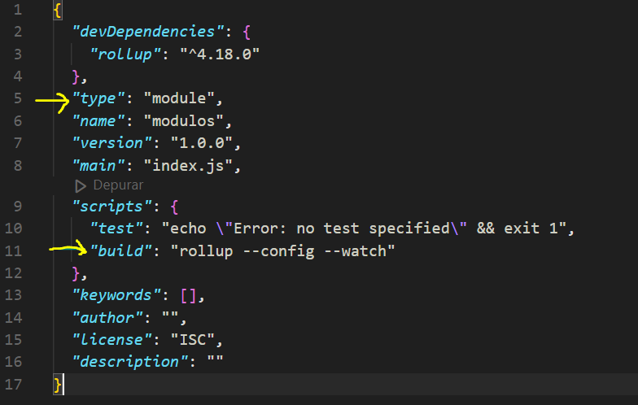

# SECCION 2: MODULOS (ES6)

## 45. Que son los modulos

En JavaScript ES6 (ECMAScript 2015) y versiones posteriores, los módulos son una forma estándar de organizar y estructurar el código en aplicaciones JavaScript. Los módulos permiten dividir el código en archivos separados y reutilizables, lo que mejora la mantenibilidad y la claridad del código, especialmente en proyectos grandes.

*Características Principales de los Módulos en ES6:*

- Encapsulación: Los módulos permiten encapsular el código, lo que significa que las variables y funciones declaradas dentro de un módulo no están disponibles en el ámbito global a menos que se exporten explícitamente.

- Exportación e Importación: Los módulos en ES6 utilizan las palabras clave export e import para exportar y luego importar funcionalidades entre diferentes archivos de código.

- Independencia: Cada archivo de módulo en ES6 tiene su propio ámbito, lo que significa que las variables y funciones definidas en un módulo no entran en conflicto con nombres de variables y funciones en otros módulos.

## 46. Instalando NodeJS

Rollup.js es una herramienta de empaquetado de módulos para JavaScript, diseñada para generar bundles (paquetes) optimizados y eficientes a partir de módulos ES6/ES2015 y CommonJS. Es especialmente útil en entornos donde se necesita combinar múltiples archivos de módulos en uno solo para su distribución y ejecución en navegadores u otros entornos de ejecución de JavaScript.

npm significa Node Package Manager (Gestor de Paquetes de Node). Es el gestor de paquetes oficial para Node.js y el ecosistema de JavaScript. npm permite a los desarrolladores instalar, compartir y gestionar paquetes de código reutilizable (también conocidos como módulos o paquetes) de forma sencilla y eficiente. Para utilizar npm tenemos que instalar nodejs

https://git-scm.com/

https://nodejs.org/en/

## 47. Como configurar la consola de git bash en visual studio code

Como configurar la consola de git bash en visual studio code
Hola, te dejo un video de mi canal de youtube en donde te enseño como integrar la consola de git bash dentro de visual studio code para que te sea mas cómodo trabajar.

Video: https://youtu.be/EVh36sDppcs

## 48. Actualizacion importante de la siguiente clase

Actualización importante de la siguiente clase
Nota Importante:
En la siguiente clase en el minuto 3:26 observaras como aparece un archivo llamado package.json que tu no tendrás.

Para poder obtener ese archivo lo único que tienes que hacer es ejecutar el comando de: npm init -y

Con este comando te agregara el archivo de package.json que yo tengo.

Después de esto ya podrás ejecutar el comando de npm install rollup

Si tienes alguna duda con este paso puedes hacer una pregunta y con gusto te responderé.

Saludos!

## 49. Instalando Rollup

Instalando Rollup de manera local:

npm install rollup --save-dev

## 50. Utilizando Rollup

Si fuera de manera global simplemente ponemos: rollup

Si trabajamos de manera local ponemos: npx rollup

Creamos la carpeta src y public

Dentro de src creamos el archivo principal index.js

**Primer Comando: npx rollup src/index.js -f cjs**

npx: Herramienta que ejecuta comandos de npm instalados localmente en el proyecto, evitando la necesidad de instalar herramientas globalmente.

rollup: El comando rollup invocado por npx, que es el empaquetador de módulos JavaScript.

src/index.js: Especifica el archivo de entrada que Rollup.js utilizará para generar el bundle. En este caso, src/index.js es el punto de entrada del código que se va a empaquetar.

-f cjs: Opción que indica el formato de salida del bundle. cjs significa CommonJS, un formato utilizado comúnmente en entornos de servidor (Node.js) para modular JavaScript

**Segundo Comando: npx rollup src/index.js -o public/bundle.js -f cjs**

npx: Al igual que en el primer comando, se utiliza para ejecutar rollup localmente.

rollup: El comando rollup que realiza el empaquetado de módulos JavaScript.

src/index.js: Especifica el archivo de entrada que se utilizará para generar el bundle. En este caso, src/index.js es el punto de entrada del código.

-o public/bundle.js: Opción que indica el nombre y la ubicación del archivo de salida (bundle.js). En este caso, el bundle se generará en el directorio public.

-f cjs: Opción que especifica el formato de salida del bundle como CommonJS (cjs), que es adecuado para entornos de servidor como Node.js.



```js
import carrito from './carrito'

console.log('Archivo inicial');
carrito();
```

```js
export default () => {
    console.log('Carrito infinito');
};
```

Creamos el archivo rollup.config.js y agregamos esto:

```js
export default {
    input: 'src/index.js',
    output: {
        file: 'public/bundle.js',
        format: 'cjs',
    },
};
```

## 51. Named Imports y Namespace Imports

```js
/*
    Named imports
*/

// import {nombre, obtenerPost} from './namedExports';
/*
Puedo generar un alias cuando importo
import {nombre as nombreImportado, obtenerPost} from './namedExports';
*/
// console.log('Mi nombre es: ' + nombre);
// console.log(obtenerPost());


/*
    Namespace imports
*/
import * as datos from './namedExports';
console.log(datos.nombre);
console.log(datos.obtenerPost());
```

```js
// Forma 1 - Palabra export
// export const nombre = 'Carlos';

// export const obtenerPost = () => {
//     return ['Post1', 'Post2', 'Post3'];
// };

// Forma 2 - Final del documento
const nombre = 'Carlos';

const obtenerPost = () => {
    return ['Post1', 'Post2', 'Post3'];
};

export {nombre, obtenerPost};
```

## 52. Default Imports

```js
/*
    Namespace imports
*/
// import * as datos from './namedExports';
// console.log(datos.nombre);
// console.log(datos.obtenerPost());

/*
    Default Imports
    La ventaja de aqui es que a la hora de importar puedo ponerle el nombre que yo quiera
*/
import obtenerUsuario from './defaultExports';
console.log(obtenerUsuario());
```

```js
// Forma 1 - mediante palabras export default
// export default () => {
//     return {
//         nombre: 'Carlos',
//         correo: 'correo@correo.com',
//     }
// }


// Forma 2 - Final del documento
const obtenerUsuario = () => {
    return {
        nombre: 'Carlos',
        correo: 'correo@correo.com',
    };
};
export default obtenerUsuario;
```

## 53. Empty Imports

```js
/*
    Empty Imports
    Carga todo el codigo pero sin hacer ningun objeto
*/
import './emptyExport';
import {correo} from './emptyExport';
console.log(correo);
```

```js
console.log('Soy codigo que se ejecuta desde el archivo emptyExports.js')
export const correo = 'correo@correo.com';
```
